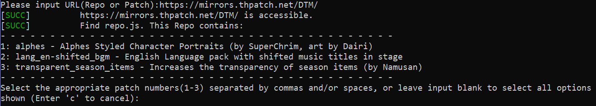
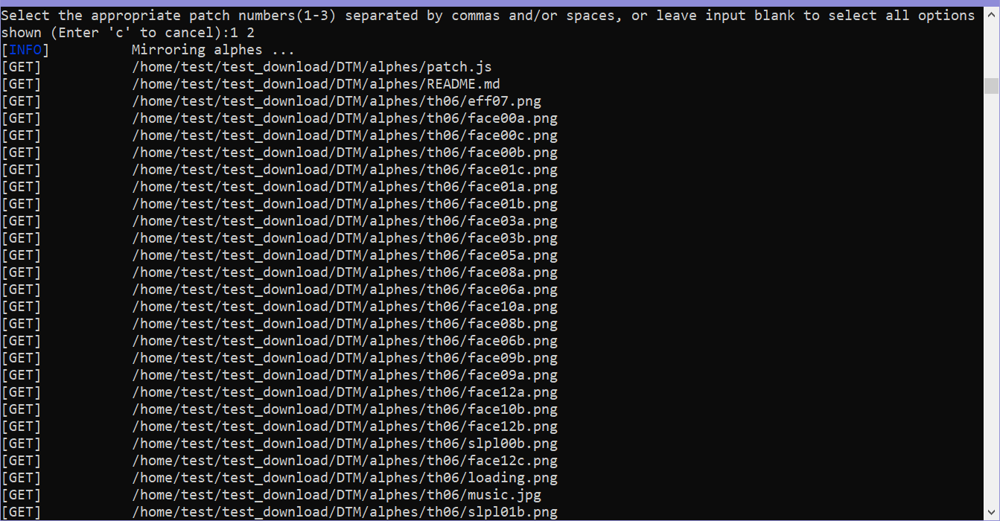
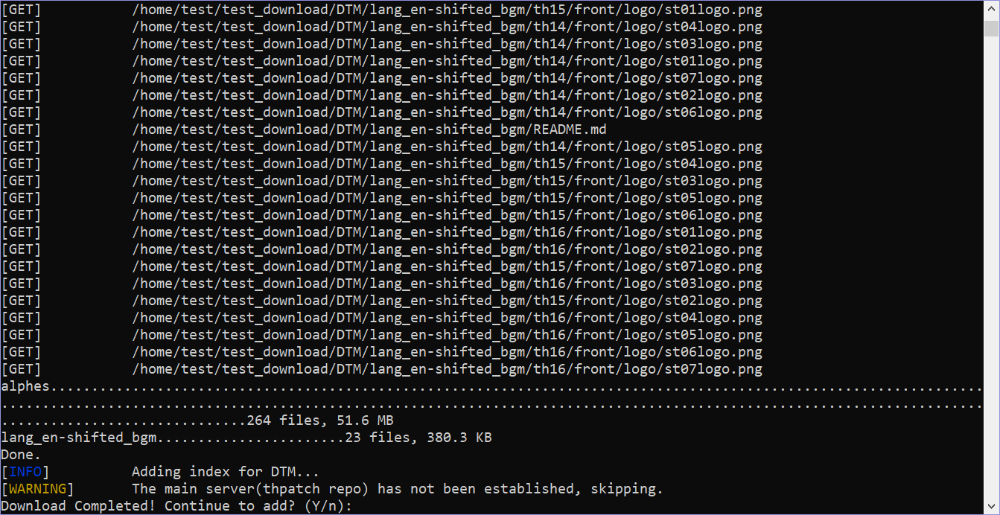

# THcrap Mirror Script


[](http://thpatch.net)
[](https://github.com/RetroCyber/thcrap_patch_mirror/issues)

[Touhou Patch Center](https://www.thpatch.net/wiki/Touhou_Patch_Center:Main_page)

[thcrap食用方法](https://thpatch.rcopky.top/attention/readme.html)

[Touhou Patch Center中文站](https://thpatch.rcopky.top/)

## Language Select / 选择语言

- [English](#Description)
- [简体中文](README_CN.md)
---

## Description

The scripts in this repository are used to facilitate users to build their own [mirror servers](https://www.thpatch.net/wiki/Touhou_Patch_Center:Servers). The main function is to add patches and perform periodic updates on them.

## Repository file list

This repository contains:

- `add_patch.py`: Used to add new patches to the mirror server.

- `mirror_repo.py`: Used to update the patch files on the mirror server, with `repo` as the update unit.

- `requirements.txt`: Dependency lib required by the scripts.

- `.github/workflows/release.yml`: used to automate binary release scripts.

- `generate_release_note.py`: used to generate the release note that accompanies the binary release scripts.

- `history.md`: Update history of the scripts.

## Usage

### `add_patch.py`

#### binary version

The binary version can be run directly:

- **Windows**
```bash
$ add_patch.exe
```

- **Linux&MacOS**
```bash
$ ./add_patch
```

#### Run `python` script

- To run the script directly, enter the following command:

```bash
# Clone repository
$ git clone https://github.com/RetroCyber/thcrap_patch_mirror.git
$ cd thcrap_patch_mirror
# Install dependency libraries
$ pip install -r requirements.txt
# Run script
$ python3 add_patch.py
```

- If running, please follow the prompts to complete the user configuration first:


<p align=center>Configuration Description</p>

- Once the configuration is generated, input the URL of the `repo` you want to add, or the URL of the `patch`:


<p align=center>Input URL</p>

- If the URL passes the script's detection, the next step is to select the patch to be added:



<p align=center>Select The Patch</p>

- After selecting, press Enter and the script will start downloading the patch file:



<p align=center>Download Files</p>

- If you exit unexpectedly, just run the script again and it will resume downloading from the interrupted position.


<p align=center>Resume download</p>

- After the download is complete, the script will automatically exit. If an unexpected exit occurs during the process, the script will ask whether to continue adding. Select "Y" to continue adding.



<p align=center>Finish Downloading</p>

> [!TIP]
> If the URL you enter is a `repo` address, please note that the URL needs to contain the `repo.js` file. The `patch` needs to contain the `patch.js` file.
>
> When the URL you input is a `patch`, you do not need to select any option, and the script will automatically start the download task.

### `mirror_repo.py`

#### Add periodic execution instructions

- Enter the following command to enter the scheduled task editing interface:

```bash
# Open the scheduled task editing interface
$ crontab -e
```

- The vim editor will open and the interface will be as follows:

```bash
# Edit this file to introduce tasks to be run by cron.
#
# Each task to run has to be defined through a single line
# indicating with different fields when the task will be run
# and what command to run for the task
#
# To define the time you can provide concrete values for
# minute (m), hour (h), day of month (dom), month (mon),
# and day of week (dow) or use '*' in these fields (for 'any').
#
# Notice that tasks will be started based on the cron's system
# daemon's notion of time and timezones.
#
# Output of the crontab jobs (including errors) is sent through
# email to the user the crontab file belongs to (unless redirected).
#
# For example, you can run a backup of all your user accounts
# at 5 a.m every week with:
# 0 5 * * 1 tar -zcf /var/backups/home.tgz /home/
#
# For more information see the manual pages of crontab(5) and cron(8)
#
# m h  dom mon dow   command
~                         
~                        
~                         
~                      
~                         
~                                              
                                  23,28         All
```

- After entering the scheduled task editing interface, press the `I` key to switch to the **INSERT** mode to insert commands.

```bash
# Edit this file to introduce tasks to be run by cron.
#
# Each task to run has to be defined through a single line
# indicating with different fields when the task will be run
# and what command to run for the task
#
# To define the time you can provide concrete values for
# minute (m), hour (h), day of month (dom), month (mon),
# and day of week (dow) or use '*' in these fields (for 'any').
#
# Notice that tasks will be started based on the cron's system
# daemon's notion of time and timezones.
#
# Output of the crontab jobs (including errors) is sent through
# email to the user the crontab file belongs to (unless redirected).
#
# For example, you can run a backup of all your user accounts
# at 5 a.m every week with:
# 0 5 * * 1 tar -zcf /var/backups/home.tgz /home/
#
# For more information see the manual pages of crontab(5) and cron(8)
#
# m h  dom mon dow   command
~                         
~                        
~                         
~                      
~                         
~                                              
-- INSERT --                                                                                          23,29         All
```

- Press **Enter** and then input the following command:

```bash
# This example runs the program every 10 seconds. You can modify the cycle as needed.
*/10 * * * * python3 /*your_path*/mirror_repo.py # Replace the *your_path* part with the path to the script
```

- When finished, type `:wq` and press **Enter** to save and exit.

## Special Thanks

- brliron
- The THPatch Team
