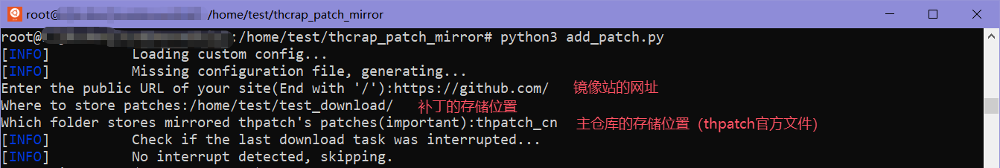
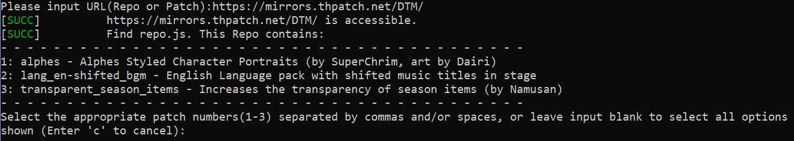
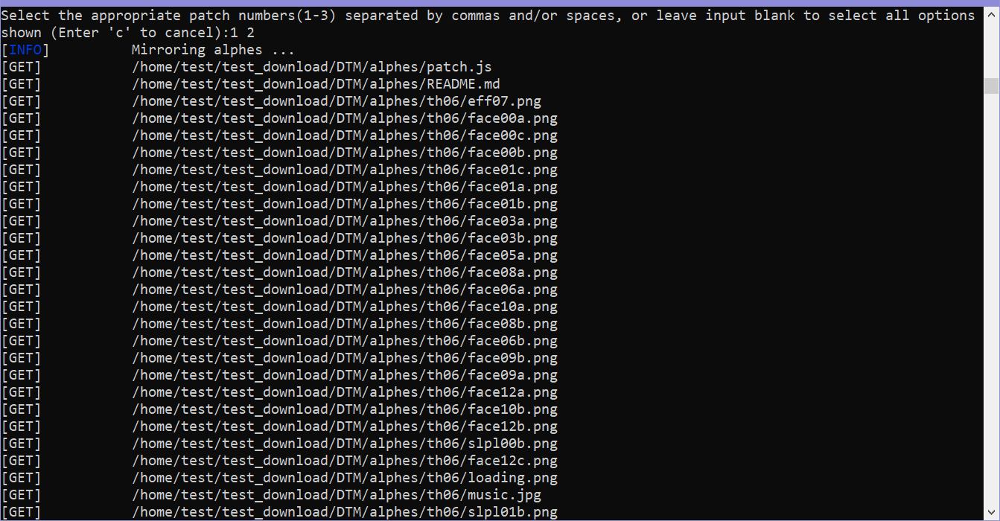
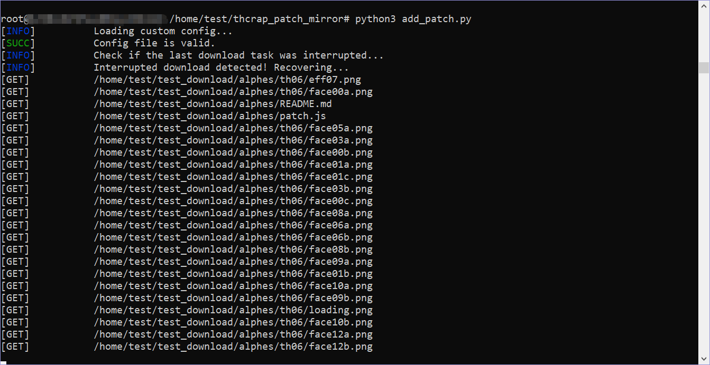
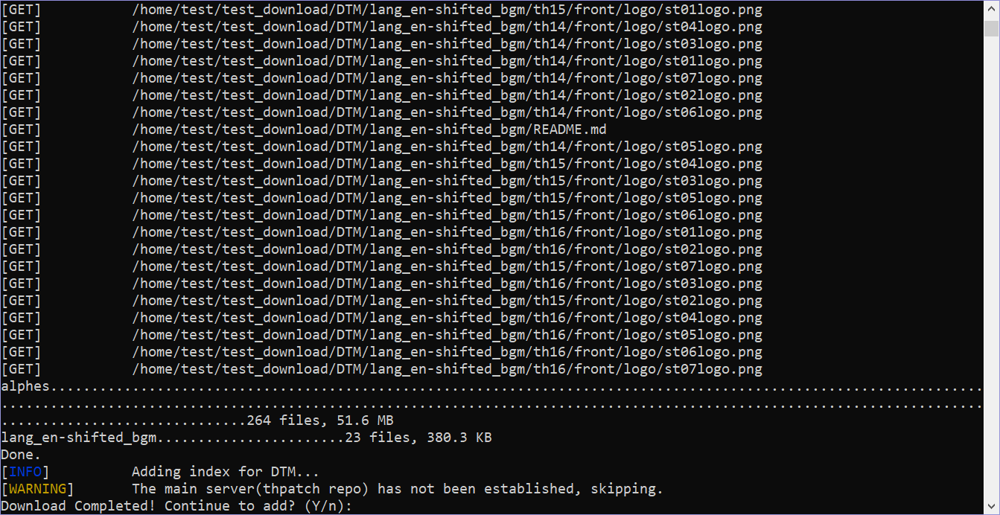

# THcrap Mirror Script


[](http://thpatch.net)
[](https://github.com/RetroCyber/thcrap_patch_mirror/issues)

[Touhou Patch Center](https://www.thpatch.net/wiki/Touhou_Patch_Center:Main_page)

[thcrap食用方法](https://thpatch.rcopky.top/attention/readme.html)

[Touhou Patch Center中文站](https://thpatch.rcopky.top/)

## 简介

本仓库内脚本用于方便用户自建[镜像服务器](https://www.thpatch.net/wiki/Touhou_Patch_Center:Servers/zh-hans)，主要功能为向镜像服务器添加补丁以及对补丁进行周期性更新。

## 仓库文件一览

- `add_patch.py`：用于向镜像服务器加入新的补丁。

- `mirror_repo.py`：用于更新镜像服务器上的补丁文件，以`repo`为更新单位。

- `requirements.txt`：脚本所需要的依赖库。

- `.github/workflows/release.yml`：用于自动发布脚本的二进制版。

- `generate_release_note.py`：用于生成发布二进制版脚本附带的release描述。

- `history.md`：脚本的更新历史。

## 使用方法

首先需要运行`add_patch.py`以添加脚本，运行方式如下：

### 运行添加补丁脚本（`add_patch.py`）

#### 运行二进制版

二进制版本可以直接运行：

- **Windows**
```bash
$ add_patch.exe
```

- **Linux&MacOS**
```bash
$ ./add_patch
```

#### 运行`python`脚本

- 若直接运行脚本，则输入以下命令：
```bash
# 克隆仓库
$ git clone https://github.com/RetroCyber/thcrap_patch_mirror.git
$ cd thcrap_patch_mirror
# 安装依赖库
$ pip install -r requirements.txt
# 运行脚本
$ python3 add_patch.py
```

- 若成功运行，请按照提示先完成用户配置：



<p align=center>配置项说明</p>

- 配置生成后，请输入要添加的补丁仓库（`repo`）的URL，或补丁（`patch`）的URL：


<p align=center>输入URL</p>

- 若URL通过了脚本的检测，下一步选择需要添加的补丁：



<p align=center>选择补丁</p>

- 选择完成后按下回车，脚本开始下载补丁文件：



<p align=center>下载文件</p>

- 若中途因为意外退出，再次运行脚本即可，脚本会从中断位置恢复下载。



<p align=center>断点续传</p>

- 下载完成后，脚本会自动退出。若中途发生过意外退出，脚本会询问是否继续添加，选择“是”即可继续添加。



<p align=center>完成下载</p>

> [!TIP]
> 若输入的为补丁仓库地址，注意URL下需要包含`repo.js`文件。补丁地址则需要包含`patch.js`文件。
> 
> 当输入的URL为补丁时，无需进行选择，脚本会自动开始下载任务。

### 配置镜像更新脚本（`mirror_repo.py`）

#### 添加周期执行指令

- 输入以下指令进入计划任务编辑界面：

```bash
# 进入计划任务编辑界面
$ crontab -e
```

- 此时会打开vim编辑器，界面如下：

```bash
# Edit this file to introduce tasks to be run by cron.
#
# Each task to run has to be defined through a single line
# indicating with different fields when the task will be run
# and what command to run for the task
#
# To define the time you can provide concrete values for
# minute (m), hour (h), day of month (dom), month (mon),
# and day of week (dow) or use '*' in these fields (for 'any').
#
# Notice that tasks will be started based on the cron's system
# daemon's notion of time and timezones.
#
# Output of the crontab jobs (including errors) is sent through
# email to the user the crontab file belongs to (unless redirected).
#
# For example, you can run a backup of all your user accounts
# at 5 a.m every week with:
# 0 5 * * 1 tar -zcf /var/backups/home.tgz /home/
#
# For more information see the manual pages of crontab(5) and cron(8)
#
# m h  dom mon dow   command
~                         
~                        
~                         
~                      
~                         
~                                              
                                  23,28         All
```

- 进入到计划任务编辑界面后，按`I`键转换到`INSERT`模式以插入命令。

```bash
# Edit this file to introduce tasks to be run by cron.
#
# Each task to run has to be defined through a single line
# indicating with different fields when the task will be run
# and what command to run for the task
#
# To define the time you can provide concrete values for
# minute (m), hour (h), day of month (dom), month (mon),
# and day of week (dow) or use '*' in these fields (for 'any').
#
# Notice that tasks will be started based on the cron's system
# daemon's notion of time and timezones.
#
# Output of the crontab jobs (including errors) is sent through
# email to the user the crontab file belongs to (unless redirected).
#
# For example, you can run a backup of all your user accounts
# at 5 a.m every week with:
# 0 5 * * 1 tar -zcf /var/backups/home.tgz /home/
#
# For more information see the manual pages of crontab(5) and cron(8)
#
# m h  dom mon dow   command
~                         
~                        
~                         
~                      
~                         
~                                              
-- INSERT --                                                                                          23,29         All
```

- 回车换行，然后在其中输入以下命令：

```bash
# 此示例为每10运行一次程序，可根据需要自行修改周期。
*/10 * * * * python3 /*your_path*/mirror_repo.py # *your_path* 部分自行替换为脚本所在路径
```

- 完成后，输入`:wq`，敲击回车以保存并退出。

## 特别鸣谢

- brliron
- THPatch团队